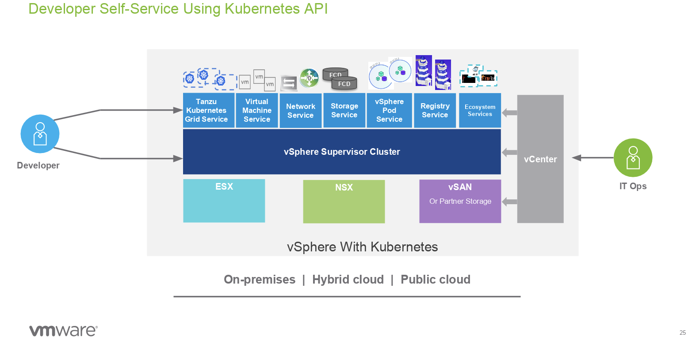

# Kubernetes on vSphere Lab

# Business Context:
Customer wants to build a Blogging software which is a called WordPress. Company wants to make WordPress available to anyone who wants to create a website or blog. In developing WordPress and making it perpetually free, its creators hoped to “democratize publishing” by designing a site building program that could allow anyone to have a voice and presence online. With that idea in mind Business owners appoached architecuture and proudct team to start working on it. After carefull consideration Product team decided that they need a kubernetes enviornment which dev teams can self service and VI Admin can provide governance. Their dev team should be able to create services like Mysql and also be able to search their logs using a dashboard. Their kubernetes enviornment also needs monitoring and team is looking for a capability where they can create dashboard monitor real time. With all this requirements VI Admin need to provide all resources to product teams so that they could self service. Team also wants isolation for some of their services.

### VI Admin Persona:

1. Create a namespace for wordpress product team.
2. Add users to namespace and prvovide them proper access.
3. Apply proper storage and quota policies.
4. Provide Federation/Role bindings for dev teams using TMC
5. Setup Application catalog for developers to create services.
6. Deploy wavefront to monitor kubernetes enviorment.
7. Deploy Elastic search and Kibana for dev teams to search their logs.

### Developer's Persona:

1. Create Mysql service using Application catalog.
2. Create workload cluster to deploy wordpress.
3. Deploy services to Native for the workloads that needs isolation.
4. Create dashboards in wavefront to monitor their enviornment.
5. Seach their logs using Kibana dashboards.

# Steps:

### CLIs
> 1. kubectl
> 2. tmc
> 3. helm 3

## 1. Installation

> 1. [Nested Install](./nestedinstall)
> 2. [Request OneCloud setup if needed](./onecloud)

## 2. Supervisor Cluster

> 	1. [Enable Supervisor Cluster](./supervisorcluster/enablecluster)
> 	2. [Enable Harbor](./supervisorcluster/enableharbor)
> 	3. [Create Namespace](./supervisorcluster/namespace)
> 	4. [Enable access control](./supervisorcluster/accesscontrol)
> 	5. [Access Supervisor Cluster](./supervisorcluster/accesscluster)
> 	6. [Deploy Nativepod](./supervisorcluster/nativepod)

## 3. Application Catalog Cluster

> 1. [Create Service Cluster](./servicecluster/createservicecluster)
> 2. [Attach to TMC](./servicecluster/attachclustertotmc)
> 3. [Integrate Application Catalog](./servicecluster/integrateapplicationcatalog)
> 4. [Install Elastic Search and Kibana](./servicecluster/EK)
> 5. [Install Wavefront](./servicecluster/wavefront)

## 4. Workload Cluster

> 1. [Create Workload Cluster](./workloadcluster/createworkloadcluster)
> 2. [Attach to TMC](./workloadcluster/attachclustertotmc)
> 3. [Install Fluent Bit](./workloadcluster/logging)
> 4. [Install Wavefront](./workloadcluster/wavefront)
> 5. [Deploy wordpress](./workloadcluster/deployworkloads)
